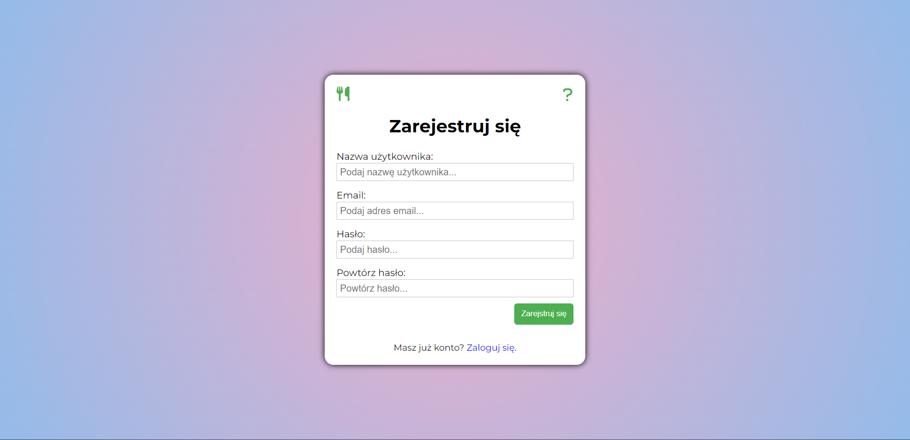

### About project:
Culinary recipes project is a blog about my grandma recipes. Users can see it on responsive website, comments and do some other things.

### Technologies:
  - Django 4.1 
  - Python 3.10
  - Bootstrap 5.0 
  - HTML/CSS & JavaScript

### Page capabilities:
  - Setting an account (optional - for more feateures)
  - Commenting posts
  - Adding posts recipes to favourite section
  - Customized admin panel for owner of a blog 
  - Changing color of website 
  
### How to run this project localy?
1. Git clone the repository
2. Set up a python virtual environment
3. Run this commands:
```
$ pip install -r requirements.txt
$ python manage.py migrate
$ python manage.py createsuperuser
$ python manage.py runserver
```
4. Open localhost:8000 no your browser

### Results
You can create account and login


See the main site with the most important informations


Add favourites posts to special section for it


Comment posts if you are login


Change color of interface

